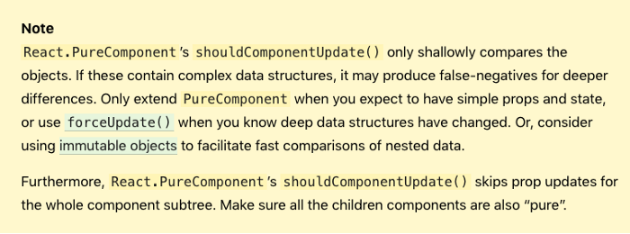
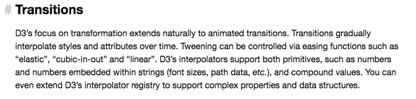
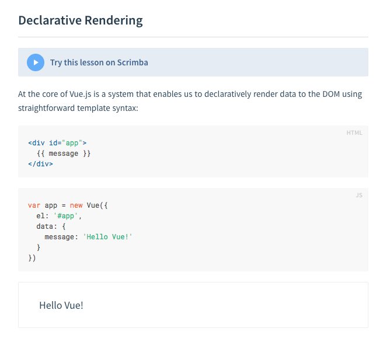
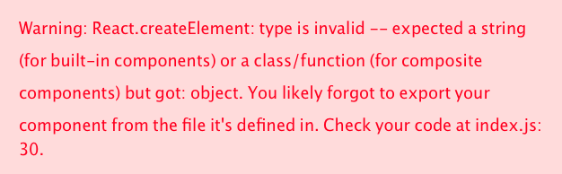
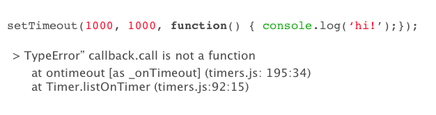
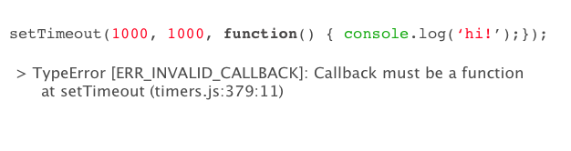
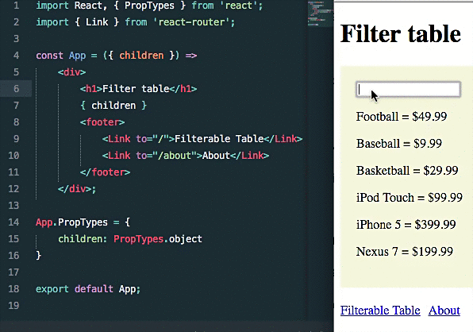

**TL;DR — DX is “the acquisition of knowledge needed to implement an API”. Make the acquisition easier; knowledge more digestible; the journey of implementing it simpler; lives of developers better**

With much talk on designing the user experience (UX) of a product, implementing ways for users to reach their goals more easily and reduce user anxiety. Most recently much of this ethos has been carried over, to make the lives of developers easier. With simpler APIs, rich ecosystems and full-on community support, it has never been easier to jump into a new library and have a play around.

## UX, DX, Why Should I Care?

The life of a developer can often be painful. Hair pulling days, where countless bugs may crop up all at once. Unforeseen edge cases make us scramble with haste to fix them, a couple of days before the software is to be shipped.

Tired Businessman — photo from Vecteezy
Our main duty here is to alleviate as many of the troubles inherent within the system. Improving ways a developer experiences the tasks at hand, can shift a lot their focus on bringing additional value to their organisation. The value in the form of less developer confusion, time spent fixing bugs and easy to learn API. Usually result in better, more maintainable software at a fraction of the time and cost.

Viewing this from the API designer, simpler APIs are adopted more quickly by the Community, who will give it more support and offer side tools. This all brings about a richer ecosystem.

This is nothing new of course, it’s been an age old problem, however this doesn’t mean it isn’t worth the investment to help our fellow developer; results in a win-win for everyone.

## Back to Basics

> If you are not a bit of geek and generally disinterested the word etymologies, skip until you reach the section From UX to DX

### How to define UX

Let’s break down the word User Experience, look at it with a thicker lens by delving into the word’s origin, doing this will enable us to decompose the term

- User — starting from the word use, which originates from the Latin word _usus_ to mean “act of using a thing”, note the word’s definition hasn’t changed its meaning for over a millennium. We can compare that to the Merriam Webster definition of “use” is “the act or practice of employing something”. Next, we can fast forward to the 20th century the definition that we closely relate to the most when we think of a user is the term “user-friendly” is said in some sources to have been coined by software designer Harlan Crowder as early as 1972.

- Experience — comes from the Latin word _experimentia_ to mean “knowledge gained by repeated trials”, the Latin noun derivative of experient-, i.e. experiment “to put to the test”, quite similar to the Merriam Webster definition of “the fact or state of having been affected by or gained knowledge through direct observation or participation”

**“The limits of my language means the limits of my world.”**

**― Ludwig Wittgenstein [Austrian Philosopher]**

Amalgamating both past and present definitions of these two words, we can formulate the word user experience to be “the acquisition of knowledge needed to employ a product”. So a good user experience is one that enables the person to:

- Gain Knowledge about our product clearly and quickly

- Easily employ our product

- Require less repeated trials to gain that specified knowledge

### How to define DX

Hence if we reverse engineer the term UX and map that onto developers. Developer Experience is one that enables a developer to:

- Gain Knowledge about an API clearly and quickly

- Easily develop a product the utilising the API, within that environment

- Require less time and attempts to implement the API in the final product

We can now finally distill DX to be “the acquisition of knowledge needed to implement an API”

## What can be learnt from UX?

From the previous chapter, we have broken the word user experience, down to its fundamental building blocks. Now, let us utilise that definition, and discover which parts of the UX, we can cherrypick that apply to DX.

**“If we want users to like our software we should design it to behave like a likeable person: respectful, generous and helpful.”**

**— Alan Cooper [Father of Visual Basic]**

Here are some chosen aspects of UX, pieces of what I believe ties in best with a well-designed API:

- Digestibility — simplicity coupled with small easy to follow steps, demand less time for developers to learn about specifics on how something might work. To put it informally, the faster you learn something, the more you can learn within that single space of time

- Clarity — it’s important to make API models highly predictable and that any errors are detailed and unambiguous, should consider stating a possible solution to the problem. Which is nice, as developers would know exactly what to expect

- Transparency — in terms of systems thinking, being able to see the inner workings of what you creating. Not only allows you to visualise it better, but also those around you

- Relatability — design how people think, rather what they ought to follow. Can allow developers to painlessly construct mental models that match how the API works and feels

## From UX to DX

So we’ve accurately described a definition for both UX and DX, and transferred over core aspects from the former to the latter. Let's apply these aspects to a more holistic measure, on the effectiveness of APIs. I will be using ReactJS to tangibly state how these measures are put into practice.

### Lower Barrier to Entry

The easier the API or tool is too learn, the sooner it can be effectively be utilised by more team members. We can even talk on a macro-scale, where an ecosystem of people revolving around a tool starts to grow, which can result in a faster rate of adoption.

This section of the React Doc contains many links and highlights on core aspects on the API, including the prerequisite term “immutable objects”. All this is necessary to aim the API at a larger audience; whether you are a junior or senior, everyone can benefit from this documentation

I specifically choose this section from the official D3JS page, as it has elements that API document authors should avoid — not disparaging the D3 library here, highly respect the work Mike Bostrom the creator is doing.

- Context unclear to beginners — Transitions is given as the title, not once is ever given a formal definition

- Esoteric Vocabulary — within the paragraphs, it mentions “transformations”, “easing functions” and “D3 Interpolators” which already throw developers who have never worked with CSS transitions and D3 straight into the deep end.

- Unclear Connections — There is no clear link between D3 Interpolators and Transitions

Reading over the section again, the author could have dramatically improved the readers understanding, just by simply attaching hyperlinks to the page itself.

## Train Developers to Overcome the Barriers

VueJS’s tutorials are an excellent example, take a look at the amount of support for absolute beginners.

VueJS documents on Declarative Rendering
The Vue team even went a step further with their interactive lessons using scrimba

### Feedback Quality

Whenever something goes wrong, it’s essential that developers receive an unambiguous, detailed response of the error, a trace-stack and even a way to deal with the problem. This may all seem obvious, however not many tools out either are very specific with the issue at hand, meaning that developers spend time searching for problems they have presumably caused, time that could be spent developing

The error message not only states the error, but it also gives the developer the likely solution to the problem _per se_. Let’s compare this to an example of the error messages of Node v4.

I want to thank Anna Henningsen for her talk on Node.js at JSConf Iceland 2018. She mentions how this error message doesn’t really describe the problem that exists.

With Anna’s help, the change to the error message for Node v5 is the one made below.

Still further improvement can be made; to state that the callback is the second argument of the setTimeout method.

### Feedback Speed

Reducing the time that it takes for code, to affect the changes made in a product, gives developers a sense of tactile instant feedback — providing developers do not have to wait long. Enables them to expend less effort assessing the small micro changes they make to the product. Below shows ReactJS ‘Hot Module Reloading’ feature, which reloads the browser whenever there is a change made to the UI.

### Noise to Signal Ratio Principle

This crops all over the tech world and is no exception here. Whenever you reduce something down to it’s the bare essentials, the concept can become clearer and more digestable.

## Conclusion

Developer Experience is a crucial concept to grasp for any team designing an API, it takes some of the aspects of UX to heart. To improve the adoption rate these APIs targets a wider audience. This is evidential from tools such as ReactJS, GraphQL and Docker, which all have very large ecosystem built around them. Leading to many tutorials, side-tools and community support.

## Summary

- User Experience means “the acquisition of knowledge needed to employ a product”

- Developer Experience means “the acquisition of knowledge needed to implement an API”

Main aspects of UX carried over to DX

- Digestibility

- Clarity

- Transparency

- Relatability

Ways to apply DX principles to APIs

- Lower Barrier to Entry
- Feedback Quality
- Feedback Speed
- Noise to Sound Ratio Principle

## References

- [ReactJS](https://reactjs.org)
- [D3JS](https://d3js.org/)
- [VueJS](https://vuejs.org/)
- [Scrimba](https://scrimba.com/)
- [Anna Henningsen: Node.js: Where are we now, where are we going? | JSConf Iceland 2018 [YouTube]](https://www.youtube.com/watch?v=O3MYg3Tp36s)
