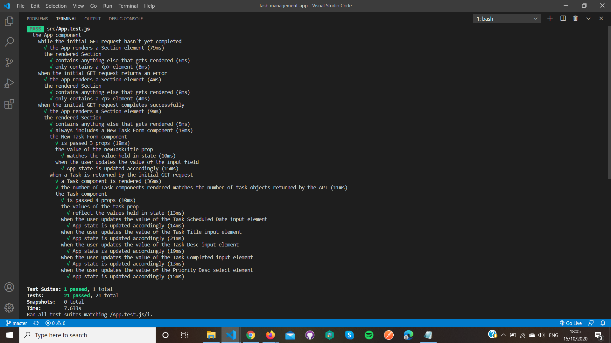
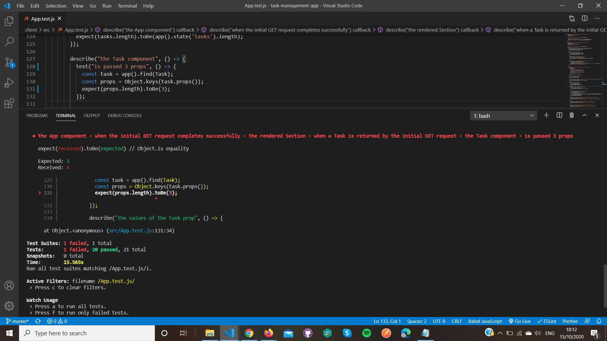

My intention in writing this is to share my experience of writing automated software tests for the first time, and to record my understanding of the concepts which I’ve learned so far. My background is that I’m a self-taught developer; I learned how to code through [Free Code Camp](https://www.freecodecamp.org/) (FCC) online, and through going to the meetups of the FCC Manchester branch. I hope that by outlining my thought processes, the challenges that I had as I approached the topic of testing as a beginner, and my current level of knowledge, I’ll be able to create a useful record. It’s not intended to be an authoritative guide for developers who are new to testing; my understanding of the subject is still very much a work in progress!

The article is about testing JavaScript (JS) code written using the [React library](https://reactjs.org/). The tests themselves were written using the [Jest](https://jestjs.io/) and [Enzyme](https://enzymejs.github.io/enzyme/) testing tools. Some parts are React specific, but I think that much of it will be relevant to any kind of JS testing, or even testing in other languages. You can find the code which I’m testing, including the tests themselves, in [this GitHub repo](https://github.com/Ross117/task-management-app/tree/master/client/src). The application is a simple, web-based task manager. It shows tasks which have already been added and allows you to update them, and it also gives you the option of adding new tasks. You can see it in action [here](https://task--manager.herokuapp.com/) (because it's deployed on the Heroku free plan, it might take a few seconds to open).

## A bit of theory

Testing is an important part of professional software development. Well written and robust automated tests can play a big part in reducing the number of bugs which find their way into production, and they give developers more confidence that introducing changes and new features won’t break pre-existing code. In fact, there is an approach to writing software called Test Driven Development (TDD) which stipulates that developers write tests first before writing any other code. Once the tests are written, the goal then becomes to make them pass by writing the application code.

Learning how to write tests was something which I knew I needed to do ever since I started learning how to code. It did take me awhile to actually get around to it though; perhaps the lure of creating my own projects was too much, and testing seemed like something that could be put off until after I’d learnt the basics. The only testing I did at first was strictly manual, for instance checking myself that a value on a web page updated in response to a button click, or checking that the background of a select element changed colour according to the value I selected. I understood that automated testing was much more robust and ultimately more time efficient because it reduced the possibility of human error and meant that you no longer had to invest time in manual testing. The question of when the right time is to learn testing when you’re a new developer is an interesting one; perhaps I could have benefited from learning how to test earlier in my journey.

When I researched testing, one of the first things I learned was that there are a number of different kinds of tests in software development. I won’t list them all here, but I will mention three types of tests which are particularly relevant for developers:

- Unit tests<br>
- Integration tests<br>
- End to end tests<br>

**Unit tests** are the most granular type of tests. They test small ‘units’ of software, typically individual functions.

**Integration tests** are used to check that different parts of the software application, for example, the server code and the client code, work together as expected.

**End to end tests** cover the flow of the application as a whole, replicating the actions of a user in various scenarios

The testing that I was most familiar with through seeing it in other peoples’ code was unit testing. It also seemed like a good idea to start off at the most granular level, so it was unit testing that I decided to tackle first.

## Trying to work out how to put theory into practice

Once I had read a bit about the theory, I wanted to start to put it into practice and write some tests myself. This proved a bit more difficult than I initially thought that it would. I had heard of the [Mocha](https://mochajs.org/) and [Chai](https://www.chaijs.com/) testing tools, so I started off by trying to test my React code using them. Mocha and Chai are essentially libraries which provide a lot of functionality for writing tests in JS. Mocha is a **test framework**, which means that it is responsible for actually executing the tests, along with reporting whether tests have passed or failed. Chai is an **assertion library**, and it’s used to check whether the values our functions produce are the ones which we expect. Mocha provides some assertion functionality itself, but Chai’s offering is richer in this area. (If at this point you’re thinking that you’d like to see what tests look like in actual code, don’t worry; I’ll include some examples a little further down).

I soon ran into a problem. My React code works by adding components to the DOM [(Document Object Model)](https://developer.mozilla.org/en-US/docs/Web/API/Document_Object_Model), and subsequently updating them based on the user interacting with the web page. How was I going to test that, for example, my code renders a form with certain pre-set values, and then updates the values based on user input? It seemed that my main problem was that I was missing the DOM - I couldn’t test the output of my code. This realisation made me reassess the tools that I was trying to use to write the tests. After a bit of research, and an informative talk by [**@peterdaily**](https://twitter.com/peterdaily) at a FCC Manchester meetup, I decided to switch to using the [Enzyme](https://enzymejs.github.io/enzyme/) and [Jest](https://jestjs.io/) testing tools. Enzyme is a **testing utility** for React, and I chose it because it’s specifically designed to test React components and comes with a virtual DOM. It includes inbuilt methods for core React practices like updating component state and passing props. These methods can be used in testing to replicate the behaviour of components when application code is running. The virtual DOM provides us with the ability to simulate rendering components to a web page, and also to simulate user interactions with the components. Jest, like Mocha, is a testing framework, and I’d heard that it works well with Enzyme. It also turned out that it was already installed in my project because I had created the initial framework for the client side code using [Create React App](https://create-react-app.dev/).

Once I’d set my project up to use Jest and Enzyme (you can look at the projects’ documentation if you’d like to know how to do this; they’re both pretty straightforward to set up), I faced another difficulty; I didn’t really know what kinds of things I should be testing my components for. This is an important part of testing; in order for tests to be of value, we need to test for the right things. I asked about this in the FCC Manchester Slack channel, and [**@peterdaily**](https://twitter.com/peterdaily) recommended [this Free Code Camp article](https://www.freecodecamp.org/news/the-right-way-to-test-react-components-548a4736ab22/) about how to test React components. The article author emphasises that it’s important that we start by spending some time thinking about how our components work, and which aspects of them we should test and which we shouldn’t (interestingly, she says that she now prefers integration tests to unit tests when testing React applications. That’s an interesting debate, but beyond my scope here). From the article, I identified the following questions as being important:

- What does the component render?
- What props does the component pass to child components?
- What does the component do with any props which it receives?
- What does the component store in state, and how is state updated?
- What happens when the user interacts with the component?

With these guideline questions in mind, I went through my components individually and wrote down the things that I wanted to test them for (I revised and expanded this several times as I actually wrote the tests.) I was also able to read the author’s test script and therefore see what she herself tested for as guidance (this had the additional benefit of helping me to work out the syntax of tests written using Jest and Enzyme). I was now finally ready to actually write some tests.

## Writing the tests

Here’s an example of one of the tests which I wrote:

```javascript
describe("the value of the newTaskTitle prop", () => {
  test("matches the value held in state", () => {
    const newTaskForm = app().find(NewTaskForm)
    expect(newTaskForm.props().newTaskTitle).toBe(app().state().newTaskTitle)
  })
})
```

It’s a relatively straightforward test, which gives us a good opportunity to take a closer look at some testing fundamentals. The outermost function is a `describe` block. It’s used to group together individual, related tests. It isn’t actually required to include a `describe` block in a Jest test script, but it does help to make tests more readable by splitting them up into distinct groups (it also allows you to provide customisations to the test environment just for a specific group of tests - we’ll see this in action below). The `test` function nested in the describe block actually executes the test (if you prefer, `it` can be used as the keyword rather than `test`, but the effect is the same). You’ll notice that for both the `describe` and `test` functions, the first argument I pass is a descriptive string. The values which you give to these strings don’t affect the actual execution of the test - you could pass an empty string if you really wanted to - but they are a very important part of the test script because they give us the ability to make tests readable. I’ve followed the pattern of using the describe string to state which part of my code I’m testing, and the test string to state what I’m testing it for. Readability is crucial because it allows anyone reading the test script, or its output, to understand exactly what is being tested, and it makes it easier to identify what is going wrong with failing tests. Readable and descriptive test scripts can also serve as documentation for code. I gained a real appreciation of test readability when I had the chance to go to a few sessions of a code club run by the Digital team at the Coop, my old employer. During the sessions we all worked together to write tests for an application (it was a ‘mob programming’ approach). I would always recommend taking the opportunity to see how more experienced developers work if you get the chance.

The second argument which is passed to the `test` function is a callback function which contains the test. The `expect` and `toBe` functions combine to make an **assertion**. Both accept values as arguments, and the relation of these values to each other determine whether the test has passed or failed. The value which is passed to `expect` should be a value you want to test. The `toBe` function is known as a **matcher**, and the value you pass to it should be the one which you want to compare the expect value to. In the case of my test above, I’m expecting the two values to be equal to each other; if they’re not the test will fail. Jest provides a great number of different matchers, including ones which check if a value is less than or greater than another value, if it’s undefined, if it’s truthy or falsey, and many more.

So far, everything that I’ve described has been Jest functionality. Enzyme enters the picture by providing the values which are passed to the `expect` and `toBe` functions. The values are derived from my components. As I mentioned earlier, Enzyme renders my components to a virtual DOM, therefore allowing me to test how they’d behave if they were rendered on an actual web page. This includes reading the values of properties such as state and props. In the code above, I check if a prop which a component passes to a child component matches the state of the parent component.

Let’s take a look at another part of my test script:

```javascript
describe("when a Task is returned by the initial GET request", () => {
  beforeEach(() => {
    const mockTask = {
      task_id: 5,
      task_creation_dt: "2020-03-30T14:24:21.437Z",
      task_title: "Finish French Homework",
      task_desc: "Involves some verb conjugation",
      task_completed: false,
      task_scheduled_dt: "2020-04-25T00:00:00.000Z",
      priority_desc: "High",
    };
    app().setState({ tasks: [mockTask] });
  });

  test("a Task component is rendered", () => {
    const tasks = app().find(Task);
    expect(tasks.length).toBe(1);
  });

  test("the number of Task components rendered matches the number of task objects returned by the API", () => {
    const tasks = app().find(Task);
    expect(tasks.length).toBe(app().state("tasks").length);
  });
```

This is an example of altering the test environment before tests are run, so that we can test the application under specific, specified conditions. It’s called **setup**. Here I’m using a `beforeEach` function provided by Jest to perform setup. The callback function which is passed to `beforeEach` will run before each of the tests in the `describe` block run; this means that I don’t have to repeat myself by writing setup code for each individual test within that block. The callback won’t run before any other test in the script which isn’t within this `describe` block, allowing me to apply setup selectively. In this case, I’m using beforeEach to amend the state of one of my components so that I can run some tests under this particular condition (the ability to change component state is provided by Enzyme). **Teardown** is the mirror of setup; it’s for when you need to do some clean up work after the tests have run. Jest’s `afterEach` function will run code after tests have completed.

It’s very important when we’re testing that we keep the testing environment under control, and that side effects from one test don’t spill over into the rest of the test script. For example, I wouldn’t want the state change that I make in the example above to apply to all of my tests. The `beforeEach` and `afterEach` functions are key tools for both modifying and then resetting the environment. In fact, at the start of both of my test scripts I use a `beforeEach` function to ensure that the component I’m testing is removed from the virtual DOM before each test in the script runs. It’s then added to the virtual DOM (technically called **mounting** in Enzyme) in the body of each test, therefore making sure I’m always working with a clean environment. I’ve found it to be very good practice to perform this kind of reset for each individual test, because it provides you with certainty that the test is passing or failing on its own merits, and not because of a hidden side effect from another test.

I’ve provided these two examples to give a basic flavour of what unit tests look like, and to introduce some fundamental concepts. There is plenty more unit testing functionality which isn’t covered in my examples (and my own knowledge doesn’t extend to all of this functionality yet). When I was writing my test scripts, the main way I learned was by starting off with an idea of what I wanted to test, then reading the Jest and Enzyme documentation to work out how to do it. If I still wasn’t sure about something, I did an internet search. I found that as I spent more time writing my tests, I began to understand the logic of testing better and the confusion which I had at the outset began to diminish. When I have more experience, I do expect that I’ll look back at this, my first attempt, and see mistakes and things which could have been done better. That’s all part of the learning process though, and it shouldn’t be a discouraging thought.

## Have my tests passed?

At this stage, you may be wondering how the tests are actually run, and how we can see whether they’ve passed or failed. This is after all the main purpose of writing the tests. Fortunately, Jest provides this information in a clear and user friendly fashion. You can access the output of your tests by running a simple command in the terminal. Let’s take a look at the output of one of my test scripts:



This output really highlights the benefit of providing descriptive strings to the `describe` and `test` functions. Jest prints these strings and indicates whether the tests associated with them have passed or not. It presents a good narrative of my test script, allowing me to see at a glance what’s been tested and whether the tests passed or not.

In the example above, all of my tests had passed. Now let’s see what kind of output Jest provides when one of my tests fails:



Jest gives me detailed information about failed tests, including printing what the **expected** and **received** values were. The expected value is the one which we pass to our matcher function (the matcher function in the above case is `toBe`), while the value we actually receive - produced from the code which we’re testing - is passed to the `expect` function. The fact that Jest prints these values out means that I have a good starting point from which to fix the problem. In this case, I can clearly see that my test was expecting a component to be passed 3 props, when in fact it was passed 4.

One question I had before starting to write tests was that if tests are written in code, surely the tests themselves can also have bugs? I have learned from experience that this can certainly be the case, and sometimes my tests failed simply because I made a mistake when I wrote them. Fortunately, the information provided by Jest when my tests did fail quickly led me to identify whether the issue was with my tests or my application code. In fact, even when a test passes I find it useful to always log the expected and received values to the console, so that I can be sure that the test is doing what I intended it to do.

## How much testing did I do?

If you read through my test scripts, you’ll notice that I test my two bigger components and not the smaller ones. The honest reason for this is that after spending quite a while writing tests for the two bigger components, I felt like I wanted to take a break from testing and work on something else for a while. Expanding the scope of the tests is on my to do list though. There’s also a fundamental part of my app that I don’t test, and that’s the API calls. My app fetches its data from a server, and gives the user the ability to make updates and add new data. Testing how the client and server code work together would, as far as I understand it, fall under integration testing. Staying within unit testing though, it is possible to ‘mock’ API calls with Jest. Mocking a request for data (i.e. a GET request) in this case would involve creating a function just for the purposes of testing which returns some dummy data rather than actually trying to connect to the server. I could then test how my client code handles the result of the API call. The practice of creating mock functionality to replace actual functionality which is, for whatever reason, beyond the scope of our testing environment is a key one in the testing world. However, when I was writing my tests I hadn’t got that far in my learning. This is something which I’m planning on remedying in the future! There is actually a term for how much of our code is covered by the tests we write; it’s called **test coverage** and it’s expressed as a percentage.

## What have I gained from the experience?

One of the big benefits I’ve got from writing tests for my app is that it made me think more deeply about how my code was structured. In order to work out what kind of tests to write, I went through my application closely with a particular focus on how it all fit together and what the key elements were. In the case of my task manager app, I wrote the tests after I’d written the application code. I’ve now however decided to adopt a TDD approach to new features. I’m currently working on adding some sort functionality to the front end of the app, and I’m starting by writing tests before I write the new component. This approach is helping me to think through how I’m actually going to implement the functionality. For example, it’s making me think about how the sort should handle null values. Another key benefit is probably the most obvious one; my tests are reducing the number of bugs in my app! I recently ran my tests after making a code change, and they highlighted a bug which I’d missed.

When I first approached testing, I wasn’t as excited to learn something new as I had been with other technologies. It can sound like a dry subject, and it can also seem like time taken away from actually building things. As I’ve described in this article, I found it took a while to get familiar with the different tools and to work out which ones I should be using. When I properly got into the subject though, I found myself enjoying it, and really appreciating the benefits which it gives me. I also definitely feel like learning how to test has made me a better developer.

There’s no doubt that testing is a big part of software development, with a lot of different tools and a lot of debate about best practices. For example, the way I went about testing my React components is certainly not the only way you can do it, and some people would argue that other methods, like snapshot testing, are a better fit. So far I’ve just scratched the surface, and I’m looking forward to carrying on expanding my knowledge in the area. Some of the things which I want to look at in the future are mocking API calls, getting a better idea of different methods of testing React components, and expanding my knowledge of testing beyond unit testing.

If you have any comments about what I’ve written here, if you’ve noticed that I’ve got something wrong, or you just want to discuss things a bit more, I’d be happy to hear from you!

**Email**: rossmorran@hotmail.co.uk<br>
**Twitter**: [@RossMorran](https://twitter.com/RossMorran)
